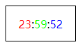
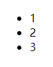
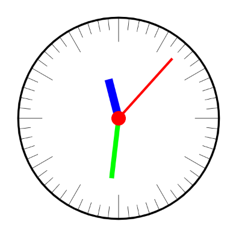
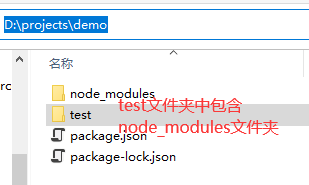

# 前端题目

## 1. 创建时钟

使用原生 `js` 使用声明式渲染，面向对象的创建一个时钟页面，要求：

- 使用 `es6` 模块化，将项目中的类拆分成模块
- 时钟包含以下几个模块
- `Pointer` 父类模块
- `Hour Minute Second` 指针子类模块
- `Clock` 时钟模块 时钟包含三个指针实例
- `Pointer Clock` 类拥有 `render` 方法，返回一段字符串（一个html的），用于描述自己长什么样子
- `Clock` 将每秒绘制页面 将自己的html代码显示到页面上

## 2. 响应式渲染

使用原生 `js` 运用声明式渲染的技巧声明一个 `List` 类，该类实例将渲染出一个列表

要求

- List 包含一个 `arr` 属性，列表渲染时使用该 `arr` 的属性值
- 监视 `arr` 的数组变化，当数组变化时更新页面
- 监视 `arr` 的数组成员变化，任意成员值发生变化时更新页面

## 3. 使用canvas绘制如图圆盘

要求

- 使用 `canvas` 绘制如图时钟
- 请让时钟正确运行
- 可以使用 `js` 动态调整时钟的时间
- 可以停止和开始计时

## 4. 使用 node.js 创建命令行工具

使用 `node.js` 创建命令行工具，用于清除垃圾文件。具体功能为：使用命令将自动清空当前目录或子目录下的所有被配置的文件或文件夹。例如：指定删除的文件夹为 `node_modules`，那么在以下路径下，运行命令，将自动删除工作路径 `D:\projects\demo` 下的所有名为 `node_modules` 的文件夹，包括子文件夹 `test` 中的 `node_modules`

要求

- 命令名称为 `killcache`
- 命令参数 `-cwd` 为工作目录，若不指定，则为调用命令的当前路径
- 命令参数 `-files` 为需要删除的文件夹或文件名，若不指定，则使用 `killcache` 默认的配置文件（制作`killcache`命令时制作一个 `json` 或 `js` 格式的配置文件）

## 5. 创建一个自动发布内容程序

请使用 `@vue/cli` 工具创建一个前端项目，使用 `node.js express` 创建一个静态资源服务器（可以使用 `nginx` 或 `apache` 替代），请在 `@vue/cli` 创建的项目中增加一个 `publish` 脚本，运行脚本达到以下下过：

- 编译构建项目得到输出文件
- 将输出文件自动发布到静态资源服务器上
- 浏览器直接访问页面达到热更新的效果

## 6. 简述如何实现一个 github 首页的球型效果

请简要介绍如何实现 `github` 首页的球型效果，用到哪些技术，有什么注意事项等。

参考：https://github.com/

## 7. 创建一个粒子发射器

请在页面上制作一个粒子发射器，单向喷射粒子

## 8. 简述 web 端实现 Virtual Reality 的原理

请简述 `web` 端实现 `Virtual Reality` 的原理，并阐述一下在浏览器上大致的实现步骤。

## 9. 制作请求队列

请给异步 `ajax` 请求，创建一个队列管理器 `AjaxQueue`，以下简称 `aq` 要求如下：

- `aq` 维护一个请求队列，队列中的请求将依序执行，上一个请求收到响应后才会执行下一个请求
- `aq` 提供加入队列和踢出队列的操作
- `aq` 允许新的请求 `插队` 到已有的队列的下一个待执行请求
- 请保证每次 `aq` 请求响应的顺序与队列顺序保持一致

## 10. web 端和服务器的实时通信

请使用 `websocket` 封装一个自身的实时通信协议，并创建 `node.js` 服务器搭建一个实时通信平台，具体要求如下：

- 协议字段如下：
  - `id`：每个客户端的 `id`
  - `room`：房间名，不可创建重复房间
  - `nickname`：客户端昵称
  - `from`：发出信息者 `id`
  - `to`：接收信息者 `id`，`scope` 为
  - `mode`：通信模式
  - `scope`：通信范围
- 通信模式 `mode`：
  - `1`：确保信息一定被接收到，`scope` 为 `broadcast` 时被忽略
  - `2`：通信超时时进行补发，补发的次数固定
  - `3`：只会发送一次信息，信息允许被丢失
- 通信范围 `scope`：
  - `toOne`：将信息发给指定客户端，此时 `to` 代表客户端 `id`
  - `toRoom`：将信息发给指定房间，此时 `to` 代表房间名称
  - `broadcast`：广播所有客户端

请按照上述协议，搭建一个用于测试的聊天系统并验证通信结果
